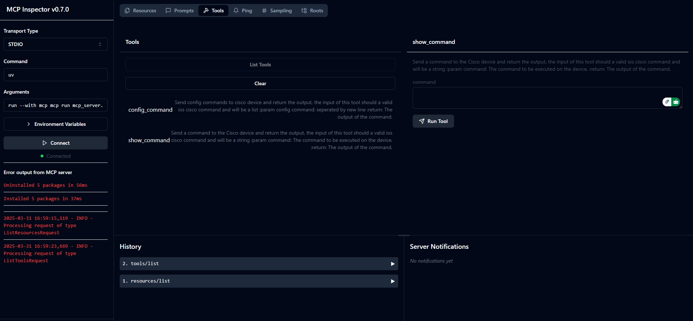
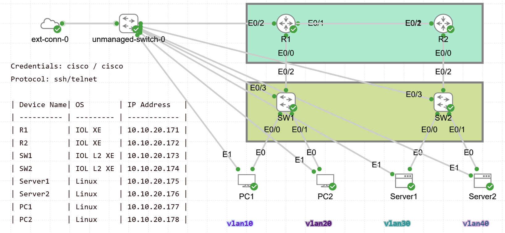
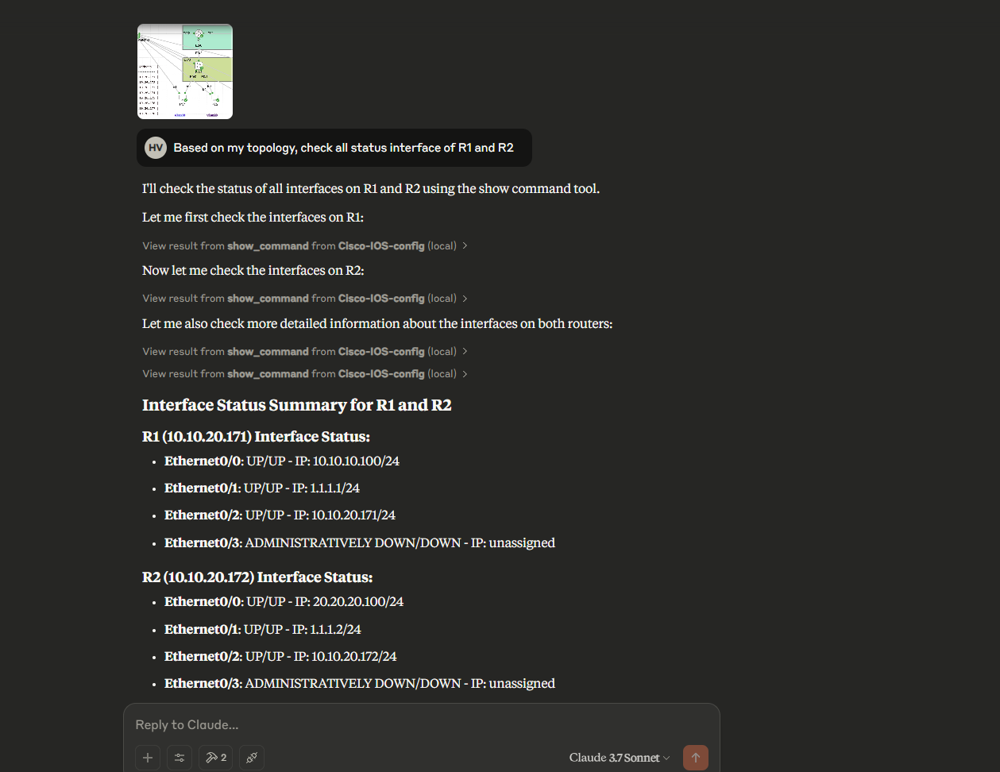

# Cisco Network Automation Tool

A powerful, AI-assisted solution for automating Cisco network device configuration and management.

[](https://www.python.org/downloads/)
[](LICENSE)

## 📋 Overview

This enterprise-grade application provides a sophisticated interface for interacting with Cisco network devices through an AI-powered automation layer. It streamlines network management by enabling both monitoring (show commands) and configuration changes with natural language processing capabilities.

## ✨ Key Features

- **Command Execution**: Execute show commands on Cisco devices with simplified syntax
- **Configuration Management**: Apply configuration changes to network devices safely
- **Natural Language Processing**: Interpret network commands through conversational language
- **Streamlined Workflows**: Simplify complex network management tasks
- **Claude Integration**: Works as an MCP extension for Claude Desktop

## 🔧 System Requirements

- Python 3.13 or higher
- Cisco network device(s) accessible via SSH or you can use (CML Cisco sandbox)
- Windows/Linux/macOS compatible

## 🚀 Quick Start

### Environment Setup with UV

This project leverages UV for efficient Python environment and package management:

```bash
# Install UV
pip install uv

# Create and activate virtual environment
cd MCP_Network_automator
uv venv
.venv\Scripts\activate  # Windows
# source .venv/bin/activate  # Linux/macOS

# Install dependencies
uv sync
```

### Installation

1. Clone the repository:
   ```bash
   git clone <repository-url>
   cd MCP_Network_automator
   ```

2. Install project and dependencies:
   ```bash
   uv venv
   .venv\Scripts\activate
   uv pip install -e .
   ```

### Claude Desktop Integration

1. Install the MCP server to your Claude Desktop:
   ```bash
   mcp install mcp_server.py
   ```

2. Inspect your mcp server:
   ```bash
   mcp dev mcp_server.py
   ```
   

   You can test if this tool work correctly or not.


3. Configure Claude Desktop by adding this to your `claude_desktop_config.json`:
   ```json
   {
     "mcpServers": {
       "Cisco-IOS-config": {
         "command": "uv",
         "args": [
           "run",
           "--with",
           "mcp[cli], netmiko",
           "mcp",
           "run",
           "C:\\Users\\<your-username>\\Documents\\MCP_Network_automator\\mcp_server.py" #Choose correct your path
         ]
       }
     }
   }
   ```
   Default location: `C:\Users\<your-username>\AppData\Roaming\Claude\claude_desktop_config.json`

## 🧰 Core Components

- **agent_client/agent_connector.py**: Core connector for Cisco device interaction, handling SSH connections and command execution
- **mcp_server.py**: MCP server implementation for network automation tools

## 💬 Example Usage

For this example, we use Cisco Modeling Labs (CML) on Cisco Sandbox to manage multiple network devices:



This case for SSH, so you need configure SSH for every device, by default, this device use telnet

The system processes natural language requests for network operations through Claude Desktop:



Example commands you can use:

```
"Show the running interfaces on the router R1 and R2"

"Configure interface GigabitEthernet0/1 with IP 192.168.1.1/24"

"Display the routing table"

"Check the status of BGP neighbors"
```

To use this tool, simply:
1. Configure your Claude Desktop with the MCP server
2. Open Claude Desktop and select the "Cisco-IOS-config" tool
3. Provide the network device credentials when prompted
4. Enter your network commands in natural language

## 🔍 Technical Details

### Technology Stack

- **Netmiko**: Powers SSH connections to Cisco devices
- **Python-dotenv**: Manages environment variables and secrets
- **Large Language Models**: Provide natural language understanding
- **Pydantic**: Ensures data validation and settings management

### Dependency Management

```bash
# Update all dependencies
uv pip compile pyproject.toml -o requirements.txt
uv pip sync requirements.txt

# Check for outdated packages
uv pip list --outdated
```

## 📦 Dependencies

- netmiko: Network device SSH connection management
- python-dotenv: Environment variable management
- mistralai/openai: AI capabilities
- pydantic: Data validation and settings management
- MCP: Model Context Protocol for Claude integration

## 📞 Support

For questions or issues, please [open an issue](https://github.com/yourusername/MCP_Network_automator/issues) on our GitHub repository.

